# 🛒 SrMart

> **Your Neighborhood, Delivered.** — A hyperlocal grocery & daily essentials marketplace built for Dibrugarh and beyond.

<p align="center">
  
</p>
---

## 📖 Table of Contents

- [Overview](#-overview)
- [Roles & Apps](#-roles--apps)
- [Features](#-features)
  - [Customer](#-customer-features)
  - [Vendor](#-vendor-features)
  - [Delivery Boy](#-delivery-boy-features)
  - [Platform-wide](#-platform-wide)
- [Screenshots](#-screenshots)
- [Tech Stack](#-tech-stack)
- [Project Structure](#-project-structure)
- [Getting Started](#-getting-started)
- [Environment Variables](#-environment-variables)
- [License](#-license)

---

## 🌐 Overview

**SrMart** is a full-featured, location-based grocery delivery platform serving local communities. It is a **single React Native Expo application** supporting three distinct roles — **Customer**, **Vendor**, and **Delivery Boy** — each with a dedicated interface and workflow.

Designed specifically for hyperlocal serviceability (e.g., Dibrugarh, Assam), SrMart connects local vendors with customers and automates the last-mile delivery experience.

---

## 👥 Roles & Apps

| Role | Description |
|------|-------------|
| 🛍️ **Customer** | Browse products, place orders, track deliveries, manage wishlist & addresses |
| 🏪 **Vendor** | Manage store, products, inventory, orders, and earnings |
| 🚴 **Delivery Boy** | Accept & complete deliveries, track earnings, manage documents |

All three roles are contained within a **single app** with **multi-role authentication**.

---

## ✨ Features

### 🛍️ Customer Features

- **Multi-vendor Browsing** — Shop from multiple local vendors in one cart experience
- **Category & Sub-category Navigation** — Organized product discovery
- **Product Search & Filters** — Find products quickly with smart search
- **Product Detail Pages** — Rich product info, images, pricing
- **Wishlist** — Save products for later
- **Cart & Checkout** — Seamless multi-vendor cart with order grouping
- **Coupon / Discount Codes** — Apply promo codes at checkout
- **Payment Gateway Integration** — Secure online payments
- **Order Groups (Multi-vendor Orders)** — Single checkout, multiple vendor fulfillment
- **Real-time Order Tracking** — Live delivery status updates
- **Offers & Deals** — Browse active promotions and discounts
- **My Addresses** — Save and manage multiple delivery addresses
- **Serviceability Check** — Location-based service availability (e.g., Dibrugarh only)
- **OTP-based Authentication** — Secure login via phone number + OTP
- **Push Notifications** — Order updates, offers, and alerts

---

### 🏪 Vendor Features

- **Vendor Dashboard** — Overview of sales, orders, and performance
- **Product Management** — Add, edit, delete products with images and pricing
- **Inventory Management** — Track and update stock levels
- **Category-based Listing** — Organize products under categories/sub-categories
- **Order Management** — View and process incoming orders
- **Order Detail View** — Full breakdown of each customer order
- **Earnings Tracker** — Monitor revenue and payout history
- **Bank Account Management** — Add/update bank details for payouts
- **Document Uploads** — Submit required KYC/business documents
- **Store Settings** — Configure store info, timings, and preferences
- **Support & Policies** — In-app support, privacy policy, terms

---

### 🚴 Delivery Boy Features

- **Delivery Dashboard** — See assigned and available deliveries
- **Order Pickup & Drop** — Step-by-step delivery workflow
- **Earnings Overview** — Daily, weekly, and total earnings
- **Vehicle Management** — Register and update vehicle details
- **Document Management** — Upload driving license, ID, etc.
- **Bank Details** — Add bank account for salary/payout
- **Profile Management** — Edit personal info
- **In-app Support** — Raise issues directly from the app
- **Push Notifications** — New order alerts and updates

---

### 🌍 Platform-wide Features

| Feature | Details |
|---------|---------|
| 🔐 **Multi-role Authentication** | Single app login for Customer, Vendor, Delivery Boy with OTP verification |
| 📍 **Location-based Serviceability** | Orders only allowed from serviceable areas (e.g., Dibrugarh) |
| 🚚 **Complex Delivery Fee Calculation** | Dynamic delivery charges based on distance, weight, vendor config |
| 🧾 **Order Groups** | Multi-vendor orders split into vendor-specific order groups |
| 🔔 **Push Notifications** | Role-specific real-time notifications |
| 🏷️ **Coupon & Discount Engine** | Promo codes, flat discounts, percentage offers |
| 💳 **Payment Gateway** | Secure integrated payment processing |
| 📦 **Inventory Management** | Vendor-side stock tracking and management |
| 🗂️ **Categories & Sub-categories** | Structured product taxonomy |
| 📊 **Earnings Dashboard** | For both Vendor and Delivery Boy |
| 📁 **Document Management** | KYC document uploads for Vendors and Delivery Boys |

---

## 📸 Screenshots

### 🛍️ Customer App

| Home | Product Detail | Cart |
|------|---------------|------|
| 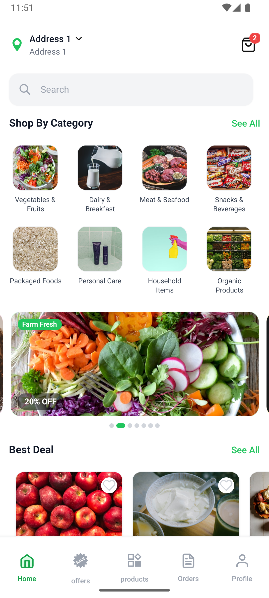 | 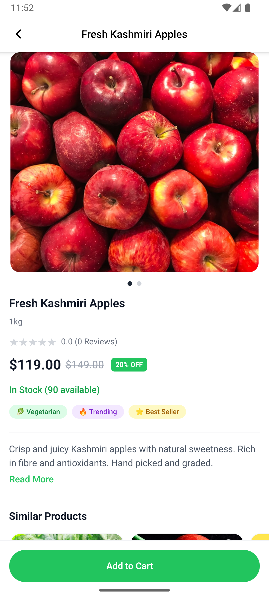 | 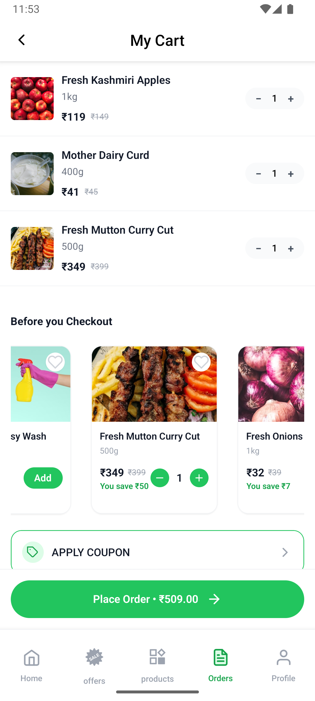 |

| Checkout | Offers | Order Tracking |
|----------|--------|----------------|
| 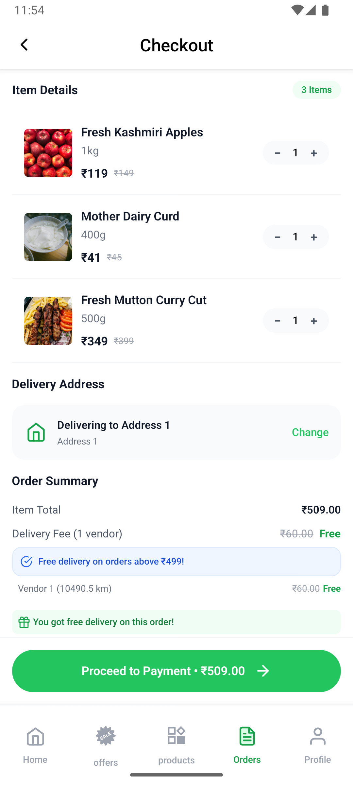 | 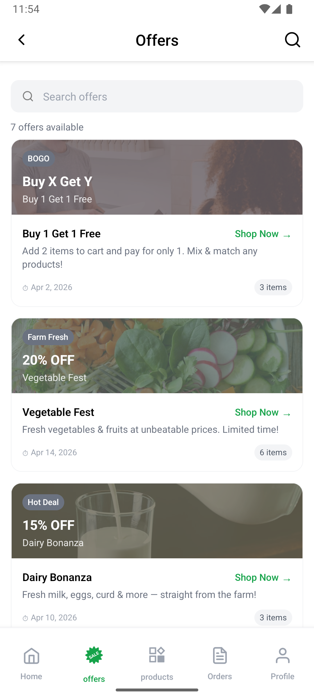 | 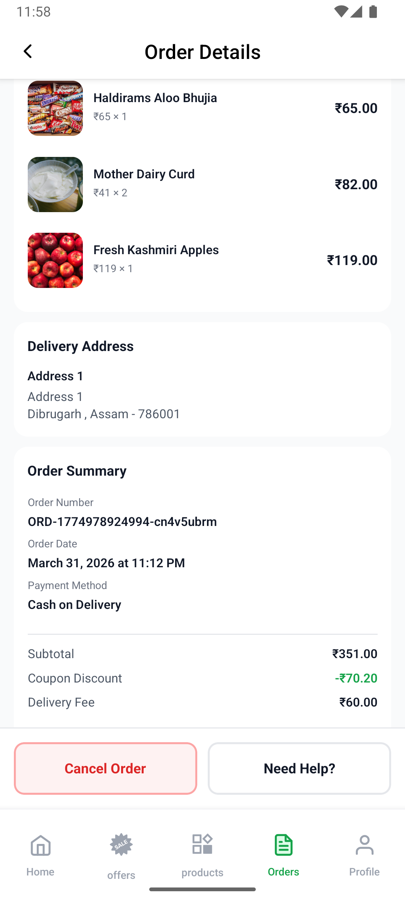 |

---

### 🏪 Vendor App

| Dashboard | Products | Add Product |
|-----------|----------|-------------|
| 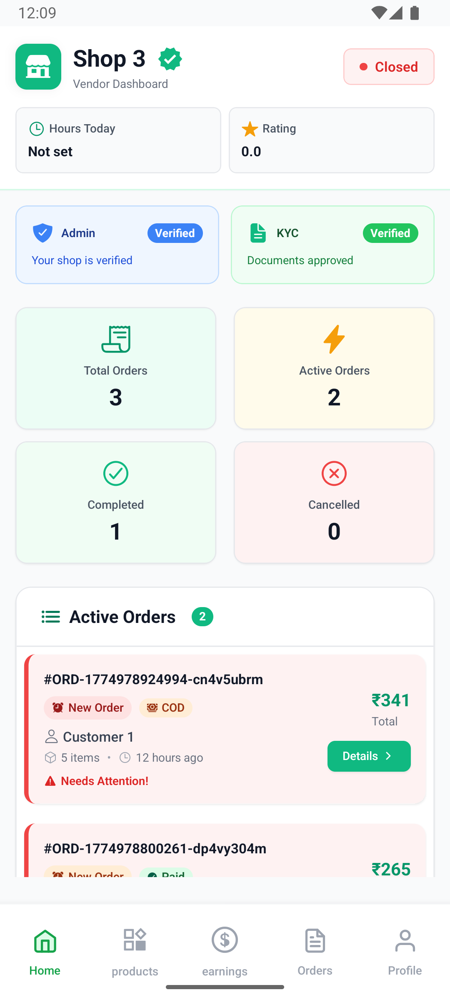 | 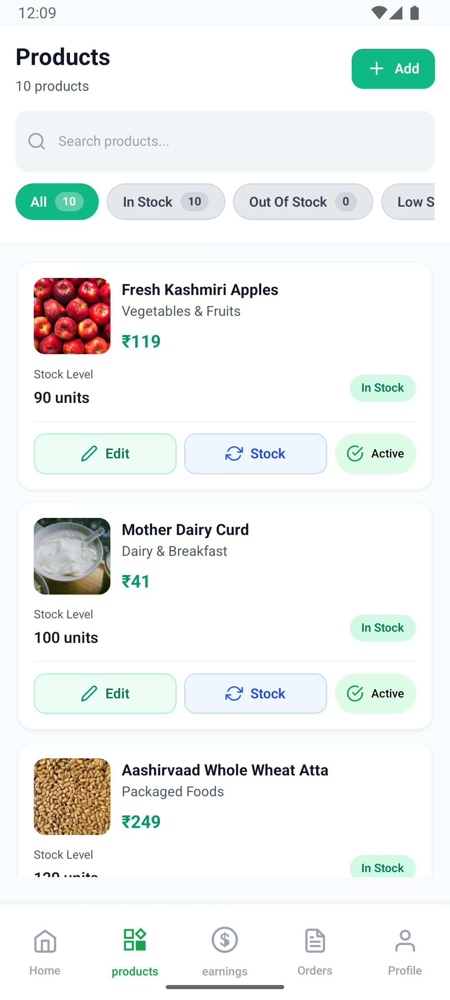 | 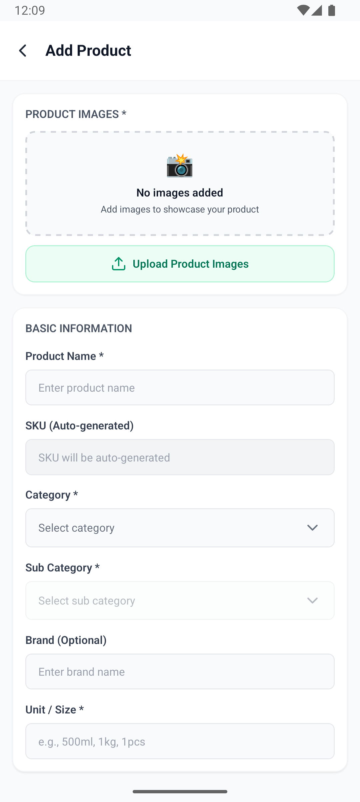 |

| Orders | Earnings | Inventory |
|--------|----------|-----------|
| 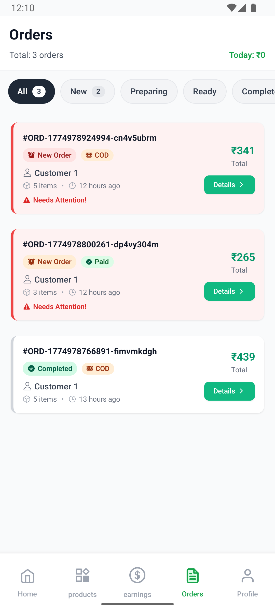 | 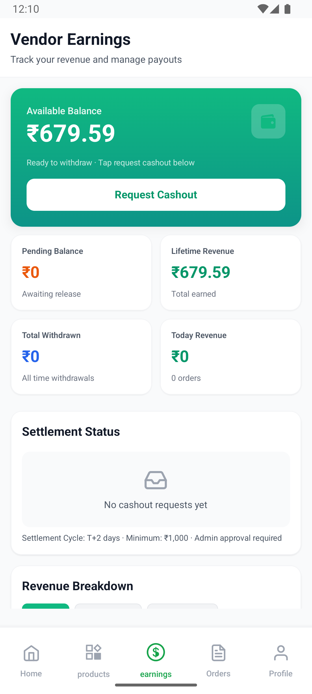 | 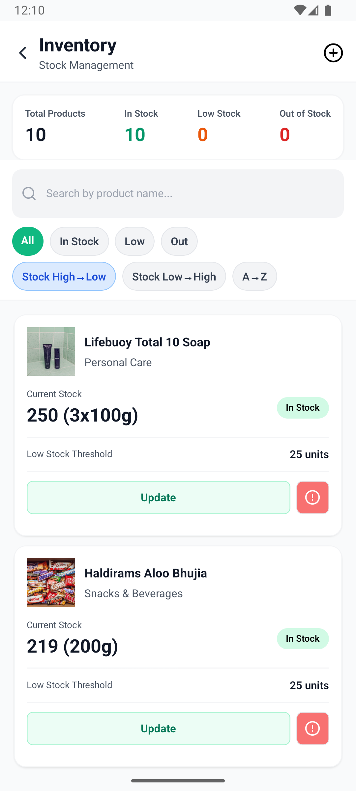 |

---

### 🚴 Delivery App

| Home | Orders | Earnings |
|------|--------|----------|
| 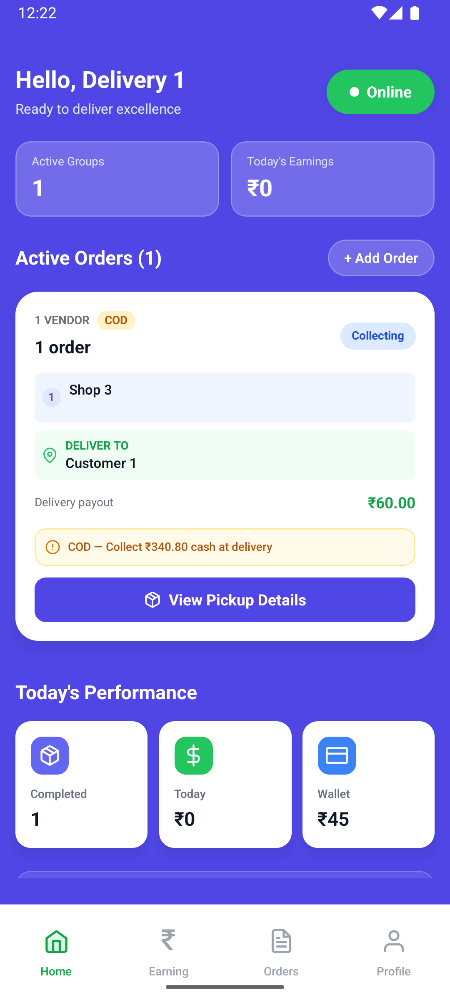 | 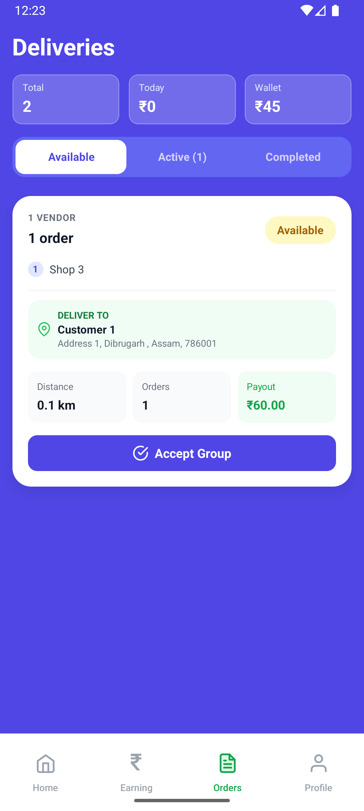 | 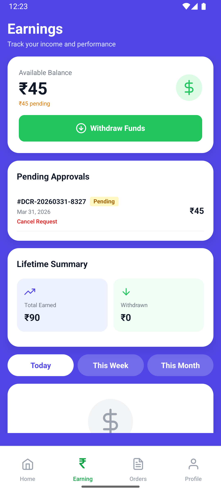 |

---

## 🛠️ Tech Stack

| Layer | Technology |
|-------|-----------|
| 📱 **Mobile App** | React Native + Expo (SDK 50+) |
| 🧭 **Navigation** | Expo Router (file-based routing) |
| 🔥 **Backend & Database** | Firebase / Supabase |
| 🔐 **Authentication** | OTP-based Phone Auth |
| 🔔 **Push Notifications** | Expo Notifications / FCM |
| 💳 **Payments** | Payment Gateway Integration |
| 📍 **Location Services** | Expo Location |
| 🗃️ **State Management** | React Context / Zustand |
| 🎨 **Styling** | React Native StyleSheet / NativeWind |

---

## 📁 Project Structure

```
. 📂 app
└── 📂 (tabs)/
│  └── 📂 customer/              # Customer role screens
│    ├── 📄 index.tsx            # Home
│    └── 📂 account/            # Profile, addresses, wishlist
│    └── 📂 category/           # Category & sub-category
│    └── 📂 offers/             # Deals & promotions
│    └── 📂 order/              # Cart, checkout, payment
│      └── 📂 order-groups/     # Multi-vendor order groups
│        └── 📂 orders/         # Individual order detail
│    └── 📂 products/           # Product listing & detail
│    └── 📂 search/             # Search & results
├📂 auth/                     # Customer auth (login, OTP, signup)
|📂 products
  ├── 📄 [productId].tsx
  ├── 📄 _layout.tsx
  └── 📄 index.tsx
├── 📂 delivery/                 # Delivery boy role
│  └── 📂 (tabs)/
│    ├── 📄 home.tsx             # Delivery dashboard
│    ├── 📄 orders.tsx           # Order list
│    ├── 📄 earning.tsx          # Earnings
│    └── 📂 profile/            # Profile, bank, documents, vehicle
│  └── 📂 auth/                 # Delivery auth
│  └── 📂 order/                # Order detail
└── 📂 vendor/                        # Vendor role
   ├── 📄 _layout.tsx
   ├── 📂 (tabs)/
   │  ├── 📄 _layout.tsx
   │  ├── 📄 dashboard.tsx            # Vendor dashboard
   │  ├── 📄 orders.tsx               # Order management
   │  ├── 📄 products.tsx             # Product listing
   │  ├── 📄 earnings.tsx             # Revenue tracking
   │  └── 📂 profile/                # Store profile, bank, documents
   │    ├── 📄 index.tsx
   │    ├── 📄 edit.tsx
   │    ├── 📄 settings.tsx
   │    ├── 📄 support.tsx
   │    └── 📂 documents/
   │      └── 📂 bank/               # Bank account management
   ├── 📂 auth/                       # Vendor auth (login, OTP, signup)
   │  ├── 📄 login.tsx
   │  ├── 📄 signup.tsx
   │  ├── 📄 verify-otp.tsx
   │  └── 📄 reset-password.tsx
   ├── 📂 inventory/                  # Inventory management
   │  └── 📄 index.tsx
   ├── 📂 order/                      # Order detail
   │  └── 📄 [orderId].tsx
   └── 📂 product/                    # Add/edit product
      ├── 📄 add.tsx
      ├── 📄 [productId].tsx
      └── 📂 edit/
         └── 📄 [productId].tsx
```

---

## 🚀 Getting Started

### Prerequisites

- Node.js >= 18.x
- npm or yarn
- Expo CLI
- Android Studio / Xcode (for emulator) or Expo Go (physical device)

### Installation

```bash
# 1. Clone the repository
git clone https://github.com/your-username/srmart.git
cd srmart

# 2. Install dependencies
npm install
# or
yarn install

# 3. Set up environment variables
cp .env.example .env
# Fill in your keys (see Environment Variables section)

# 4. Start the development server
npx expo start
```

### Running on Device

```bash
# Android
npx expo run:android

# iOS
npx expo run:ios

# Expo Go (scan QR code)
npx expo start
```

---

## 🔑 Environment Variables

Create a `.env` file in the root directory:

```env
# Supabase
EXPO_PUBLIC_SUPABASE_URL=your_supabase_project_url
EXPO_PUBLIC_SUPABASE_ANON_KEY=your_supabase_anon_key

# Push Notifications (OneSignal)
EXPO_PUBLIC_ONESIGNAL_APP_ID=your_onesignal_app_id

# Error Monitoring (Sentry)
SENTRY_AUTH_TOKEN=your_sentry_auth_token
```

| Variable | Description |
|----------|-------------|
| `EXPO_PUBLIC_SUPABASE_URL` | Your Supabase project URL from the Supabase dashboard |
| `EXPO_PUBLIC_SUPABASE_ANON_KEY` | Your Supabase public anon key |
| `EXPO_PUBLIC_ONESIGNAL_APP_ID` | OneSignal App ID for push notifications |
| `SENTRY_AUTH_TOKEN` | Sentry auth token for error tracking & crash reporting |

> ⚠️ Never commit your `.env` file. Add it to `.gitignore`.

---

## 📍 Serviceability

SrMart currently serves **Dibrugarh, Assam, India**. Orders from outside the serviceable area are automatically restricted. Serviceability is determined by the user's GPS location at the time of checkout.

To configure serviceable zones, update the location boundaries in your backend/Supabase config.

---

## 📦 Order Flow

```
Customer Places Order
        ↓
Order Split into Order Groups (per Vendor)
        ↓
Each Vendor Confirms Their Group
        ↓
Delivery Boy Assigned per Group
        ↓
Delivery Fee Calculated (Distance + Config)
        ↓
Real-time Tracking → Delivered ✅
```

---

## 📄 License

```
Copyright (c) 2024 SrMart. All Rights Reserved.

This software and its source code are proprietary and confidential.
Unauthorized copying, distribution, modification, or use of this
software, in whole or in part, is strictly prohibited without the
prior written permission of the owner.
```

---

<div align="center">
  <p>Built with ❤️ for Dibrugarh, Assam</p>
  <p><strong>SrMart</strong> — Your Neighborhood, Delivered.</p>
</div>
